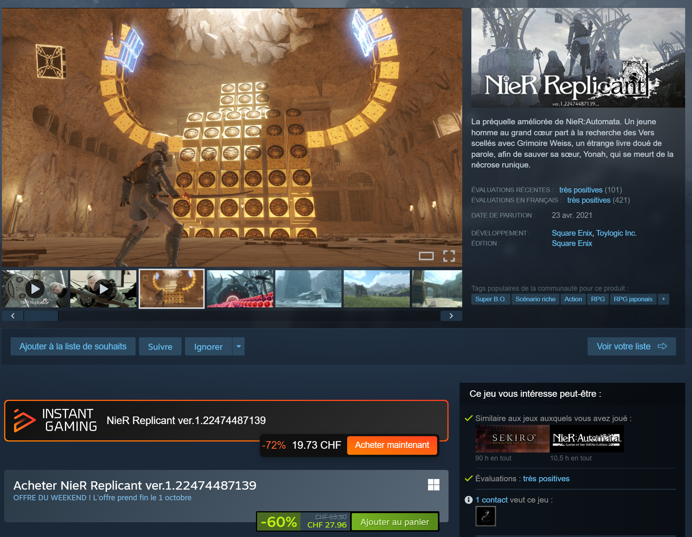

# Instant Gaming Price for Millennium

Instant Gaming Price is an open-source [Millennium](https://steambrew.app/) plugin that adds Instant Gaming offers to Steam store game pages and the Steam wishlist.

Current version: **1.3.0**.



## Features

- Shows the Instant Gaming price, discount and a direct offer button on Steam game pages.
- Adds a compact Instant Gaming price row to wishlist entries without replacing Steam controls.
- Opens offers in the operating system's default browser.
- Matches offers using both the Steam AppID and game name.
- Validates all returned links and only allows HTTPS links on `www.instant-gaming.com`.
- Caches results for 15 minutes and fails silently when an offer is unavailable.

## Installation

Once accepted into the Millennium Plugin Database, install the plugin from Millennium's built-in plugin browser.

For local development, clone the repository and run:

```text
pnpm install --frozen-lockfile
pnpm run build
```

The build produces `index.js` and `webkit.js` in `.millennium/Dist`, which the Millennium Plugin Database packages together with `plugin.json`. Millennium 3.4 or newer is recommended.

## How it works

The webview integration extracts the AppID from the current Steam URL and the game name from the page. It requests the same public-facing endpoint used by Instant Gaming's browser integration, without sending Steam credentials or browser cookies. Responses are validated before anything is rendered.

Wishlist rows are virtualized by Steam, so the plugin observes page changes and only inserts one isolated element per visible entry. It does not patch Steam's React components.

## Privacy and network access

The plugin sends the Steam AppID, game name, page language and generic campaign labels to `https://www.instant-gaming.com/ext_api/`. It does not collect analytics, use an affiliate identifier, read Steam credentials or operate a backend service.

## Known limitation

Instant Gaming does not document this endpoint as a stable public API. A server-side change or anti-bot protection can temporarily prevent prices from appearing. When that happens, Steam's page remains unchanged and the plugin writes a concise diagnostic to the Millennium logs.

## Disclaimer

This is an independent community project. It is not affiliated with, endorsed by or sponsored by Instant Gaming, Valve, Steam or the Millennium project. Instant Gaming and its logo are trademarks of their respective owner. See [THIRD_PARTY_NOTICES.md](THIRD_PARTY_NOTICES.md).

## License

Except for `webkit/logo.ts`, the source code is released under the [MIT License](LICENSE).
The embedded Instant Gaming wordmark file is redistributed under the
[Mozilla Public License 2.0](LICENSES/MPL-2.0.txt); trademark rights are not
granted. See [THIRD_PARTY_NOTICES.md](THIRD_PARTY_NOTICES.md).
